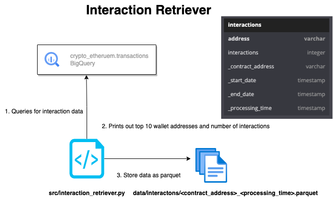
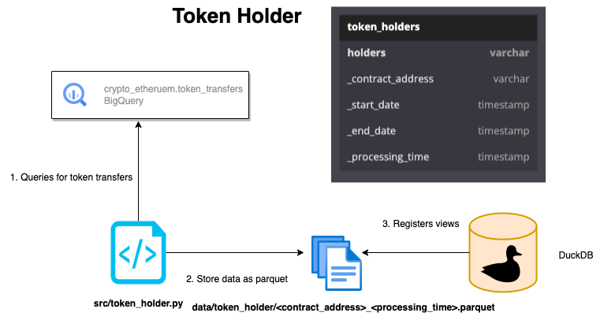

# Zapper take home assessment

## Solution for Question 1



The [interaction retriever](src/interaction_retriever.py) is a python application that, given a smart contract address on the ethereum chain, returns the top 10 addresses that has the most amount of interactions with the address. 

The [_get_interaction_query](interaction_retriever.py#L18) function string interpolates the contract address we want to retrieve the interactions for using the following [SQL query template](src/interaction_retriever.py#L26). The interpolated SQL query selects data from the Ethereum network dataset on Google BigQuery to determine the top 10 Ethereum addresses that have had the most interactions with a given contract address in the last month.

It does so by first creating a common table expression (CTE) named [transaction_addresses](src/interaction_retriever.py#L27), which identifies all the addresses that have interacted with the specified contract address in the last month. To achieve this, the CTE selects all transactions that have occurred in the last month involving the specified contract address, and then extracts the from_address and to_address fields from each transaction using the `UNNEST()` function. If the to_address of the transaction matches the specified contract address, the from_address is selected as the address, otherwise, the to_address is selected as the address. The resulting CTE contains a list of unique addresses that have interacted with the specified contract address in the last month.

The [main query](src/interaction_retriever.py#L39) then selects data from the [transaction_addresses](src/interaction_retriever.py#L27) CTE and groups the data by address. It then counts the number of interactions each address had with the specified contract address and orders the results in descending order of interaction count. Finally, it limits the output to the top 10 addresses with the highest interaction count.

To run the `interaction retriever` app, you can pass in the contract address you want to get interaction data for as the first argument to the python invocation (**NOTE** it [defaults](src/interaction_retriever.py#L54) to the [USDC](https://etherscan.io/token/0xa0b86991c6218b36c1d19d4a2e9eb0ce3606eb48) contact address ). 

To run the following code you need to pass in the path to a [GCP Service Account Key JSON](https://cloud.google.com/iam/docs/keys-create-delete) that has the [Big Query Job User role](https://cloud.google.com/iam/docs/understanding-roles#bigquery.jobUser) set to the `GCP_SA` envar.

```sh
# Create and activate  virtualenv and install dependencies
virtualenv venv -p python3
source venv/bin/activate 
pip install -r requirements.txt

# Set GCP Service account envar
# Retrieve all interactions with USDT
GCP_SA=zapper_tha_sa.json \
DATE_INTERVAL=MONTH \
python src/interaction_retriever.py 0xdac17f958d2ee523a2206206994597c13d831ec7
```

Invoking the `interaction_retriever` with the address for the USDT contract will retrieve the top 10 addresses that has interacted with it print out an enriched dataframe of the query result set as a pandas dataframe. 

It also flushes the dataframe as a parquet file into the `data/interactions` directory with files sharded by the `<contracted_address>_<query_processing_day>`.

```sh
INFO:__main__:Extracting information for contract address: 0xdac17f958d2ee523a2206206994597c13d831ec7
INFO:__main__:flushed dataframe to data/interactions
                                      address  interactions                           _CONTRACT_ADDRESS _start_date   _end_date
0  0xa152f8bb749c55e9943a3a0a3111d18ee2b3f94e        132922  0xdac17f958d2ee523a2206206994597c13d831ec7  2023-03-21  2023-04-18
1  0x56eddb7aa87536c09ccc2793473599fd21a8b17f        127016  0xdac17f958d2ee523a2206206994597c13d831ec7  2023-03-21  2023-04-18
2  0x21a31ee1afc51d94c2efccaa2092ad1028285549        122292  0xdac17f958d2ee523a2206206994597c13d831ec7  2023-03-21  2023-04-18
3  0xdfd5293d8e347dfe59e90efd55b2956a1343963d        122178  0xdac17f958d2ee523a2206206994597c13d831ec7  2023-03-21  2023-04-18
4  0x46340b20830761efd32832a74d7169b29feb9758        116174  0xdac17f958d2ee523a2206206994597c13d831ec7  2023-03-21  2023-04-18
5  0x9696f59e4d72e237be84ffd425dcad154bf96976        115274  0xdac17f958d2ee523a2206206994597c13d831ec7  2023-03-21  2023-04-18
6  0x28c6c06298d514db089934071355e5743bf21d60        102054  0xdac17f958d2ee523a2206206994597c13d831ec7  2023-03-21  2023-04-18
7  0xf89d7b9c864f589bbf53a82105107622b35eaa40         96806  0xdac17f958d2ee523a2206206994597c13d831ec7  2023-03-21  2023-04-18
8  0x6dfc34609a05bc22319fa4cce1d1e2929548c0d7         66884  0xdac17f958d2ee523a2206206994597c13d831ec7  2023-03-21  2023-04-18
9  0x974caa59e49682cda0ad2bbe82983419a2ecc400         66804  0xdac17f958d2ee523a2206206994597c13d831ec7  2023-03-21  2023-04-18
```

## Solution to Question #2

### Assumptions
**We only want to know the current holders of USDC, who have held the token during the last month**



In the context of this take-home assessment, I chose [DuckDB](https://duckdb.org/) as it provides a lightweight and efficient way to ingest parquet files, create views, and perform OLAP workflows. The ability to use the DuckDB CLI to ingest a SQL file with pointers to parquet files makes it easy to automate the process of ingesting data, creating views, and executing complex queries. The [out-of-core processing](https://duckdb.org/2021/06/25/querying-parquet.html) capabilities of DuckDB also make it well-suited for working with large datasets that may not fit into memory, while the [filter and projection pushdown](https://duckdb.org/2021/06/25/querying-parquet.html#automatic-filter--projection-pushdown) capabilities help to ensure that queries are executed as efficiently as possible.

DuckDB is an embedded SQL OLAP database management system that is designed to be lightweight and efficient. It is designed to be used in applications that require fast, scalable, and flexible data analytics, and is particularly well-suited for use in data science and analytics applications.

One of the key features of DuckDB is its support for out-of-core processing. This means that DuckDB is able to handle datasets that are too large to fit into memory, by using disk-based storage to store and manipulate the data. This makes it ideal for use with large datasets that may not fit into memory, such as parquet files.

Another key feature of DuckDB is its support for filter and projection pushdown. This means that when a query is executed, DuckDB is able to push as much of the computation down to the storage layer as possible. This helps to reduce the amount of data that needs to be loaded into memory and processed by the database engine, resulting in faster query execution times.

#### Install dependencies

Install the [DuckDB cli](https://duckdb.org/docs/api/cli.html#installation) for your environment. 

#### Prepare the token holder dataset

To run the `token holder` app, you can pass in the contract address you want to get interaction data for as the first argument to the python invocation (**note** it [defaults](interaction_retriever.py#L51) to the [USDC](https://etherscan.io/token/0xa0b86991c6218b36c1d19d4a2e9eb0ce3606eb48) contact address ).

```bash
# Create and activate  virtulaenv and install dependencies
virtualenv venv -p python3
source venv/bin/activate 
pip install -r requirements.txt

# Set GCP Service account envar
# Ingest BQ data into parquet files for holders of USDT over the past month
GCP_SA=zapper_tha_sa.json \
DATE_INTERVAL=MONTH \
python src/token_holder.py 0xdac17f958d2ee523a2206206994597c13d831ec7
```

Invoking the `token_holder.py` app with the [USTD](https://etherscan.io/token/0xdac17f958d2ee523a2206206994597c13d831ec7) contract address will yeild the following output and flush the result set dataframe as a parquet file:

```bash
INFO:__main__:Extracting token holder information for contract address: 0xdac17f958d2ee523a2206206994597c13d831ec7 for the last MONTH
INFO:__main__:QUERY: 
    SELECT
        CASE 
            WHEN to_address = '0xdac17f958d2ee523a2206206994597c13d831ec7' THEN from_address
            ELSE to_address
        END AS holder
    FROM `bigquery-public-data.crypto_ethereum.token_transfers`
    WHERE DATE(block_timestamp) >= DATE_SUB(CURRENT_DATE(), INTERVAL 1 MONTH)
        AND token_address = '0xdac17f958d2ee523a2206206994597c13d831ec7'
    GROUP BY holder
    
INFO:__main__:flushed dataframe to data/token_holders
```

The [token_holder](src/token_holder.py) app extracts token holder information from the `bigquery-public-data.crypto_ethereum.token_transfers` table, filters it by a specified contract address and date range, and saves the results to a Parquet file.

The [_get_holder_query](src/token_holder.py#L18) function takes a contract address as an argument and returns a string-interpolated SQL query template that selects the holder of tokens associated with the specified contract address, within a specified date range. The function uses a CASE statement to determine whether the to_address or from_address field should be used as the holder, depending on whether the tokens were transferred into or out of the contract. The function also logs the resulting query string for debugging purposes.

```
SELECT
        CASE 
            WHEN to_address = '{CONTRACT_ADDRESS}' THEN from_address
            ELSE to_address
        END AS holder
    FROM `bigquery-public-data.crypto_ethereum.token_transfers`
    WHERE DATE(block_timestamp) >= DATE_SUB(CURRENT_DATE(), INTERVAL 1 {DATE_INTERVAL})
        AND token_address = '{CONTRACT_ADDRESS}'
    GROUP BY holder
```

The script takes a command-line argument specifying the contract address to extract token holder information for, or uses a default address if no argument is provided. It then calls the _get_holder_query function with the contract address to create a query string, and executes the query using the BigQuery client's query method. The results are converted to a Pandas DataFrame using the to_dataframe method.

The script then adds additional information to the DataFrame, including the contract address, start and end dates, and processing time, and saves the DataFrame to a Parquet file in a specified directory. The directory is created if it does not exist.

#### Duckdb ingest

We can then ingest the parquet files for both the `interactions` and `token_holder` datasets into DuckDB with the following:

```sh
# Register parquet files as views in DuckDB using the DuckDB CLI to enable out of core processing
duckdb < ingest_parquet.sql

# Open the db using the DuckDB CLI
duckdb zapper.duckdb
```

```sql
D show tables;
┌───────────────┐
│     name      │
│    varchar    │
├───────────────┤
│ interactions  │
│ token_holders │
└───────────────┘
D select * from interactions;
┌────────────────────────────────────────────┬──────────────┬────────────────────────────────────────────┬─────────────┬────────────┬────────────────────────────┐
│                  address                   │ interactions │             _contract_address              │ _start_date │ _end_date  │      processing_time       │
│                  varchar                   │    int64     │                  varchar                   │   varchar   │  varchar   │         timestamp          │
├────────────────────────────────────────────┼──────────────┼────────────────────────────────────────────┼─────────────┼────────────┼────────────────────────────┤
│ 0xa152f8bb749c55e9943a3a0a3111d18ee2b3f94e │       133566 │ 0xdac17f958d2ee523a2206206994597c13d831ec7 │ 2023-03-21  │ 2023-04-18 │ 2023-04-18 15:51:53.999956 │
│ 0x56eddb7aa87536c09ccc2793473599fd21a8b17f │       127944 │ 0xdac17f958d2ee523a2206206994597c13d831ec7 │ 2023-03-21  │ 2023-04-18 │ 2023-04-18 15:51:53.999956 │
│ 0x21a31ee1afc51d94c2efccaa2092ad1028285549 │       123248 │ 0xdac17f958d2ee523a2206206994597c13d831ec7 │ 2023-03-21  │ 2023-04-18 │ 2023-04-18 15:51:53.999956 │
│ 0xdfd5293d8e347dfe59e90efd55b2956a1343963d │       123028 │ 0xdac17f958d2ee523a2206206994597c13d831ec7 │ 2023-03-21  │ 2023-04-18 │ 2023-04-18 15:51:53.999956 │
│ 0x46340b20830761efd32832a74d7169b29feb9758 │       117354 │ 0xdac17f958d2ee523a2206206994597c13d831ec7 │ 2023-03-21  │ 2023-04-18 │ 2023-04-18 15:51:53.999956 │
│ 0x9696f59e4d72e237be84ffd425dcad154bf96976 │       116132 │ 0xdac17f958d2ee523a2206206994597c13d831ec7 │ 2023-03-21  │ 2023-04-18 │ 2023-04-18 15:51:53.999956 │
│ 0x28c6c06298d514db089934071355e5743bf21d60 │       102758 │ 0xdac17f958d2ee523a2206206994597c13d831ec7 │ 2023-03-21  │ 2023-04-18 │ 2023-04-18 15:51:53.999956 │
│ 0xf89d7b9c864f589bbf53a82105107622b35eaa40 │        97532 │ 0xdac17f958d2ee523a2206206994597c13d831ec7 │ 2023-03-21  │ 2023-04-18 │ 2023-04-18 15:51:53.999956 │
│ 0x974caa59e49682cda0ad2bbe82983419a2ecc400 │        67328 │ 0xdac17f958d2ee523a2206206994597c13d831ec7 │ 2023-03-21  │ 2023-04-18 │ 2023-04-18 15:51:53.999956 │
│ 0x6dfc34609a05bc22319fa4cce1d1e2929548c0d7 │        67242 │ 0xdac17f958d2ee523a2206206994597c13d831ec7 │ 2023-03-21  │ 2023-04-18 │ 2023-04-18 15:51:53.999956 │
│ 0xa152f8bb749c55e9943a3a0a3111d18ee2b3f94e │        36668 │ 0xa0b86991c6218b36c1d19d4a2e9eb0ce3606eb48 │ 2023-03-21  │ 2023-04-18 │ 2023-04-18 15:52:12.104472 │
│ 0x55fe002aeff02f77364de339a1292923a15844b8 │        35360 │ 0xa0b86991c6218b36c1d19d4a2e9eb0ce3606eb48 │ 2023-03-21  │ 2023-04-18 │ 2023-04-18 15:52:12.104472 │
│ 0xf89d7b9c864f589bbf53a82105107622b35eaa40 │        30588 │ 0xa0b86991c6218b36c1d19d4a2e9eb0ce3606eb48 │ 2023-03-21  │ 2023-04-18 │ 2023-04-18 15:52:12.104472 │
│ 0x28c6c06298d514db089934071355e5743bf21d60 │        25808 │ 0xa0b86991c6218b36c1d19d4a2e9eb0ce3606eb48 │ 2023-03-21  │ 2023-04-18 │ 2023-04-18 15:52:12.104472 │
│ 0x46340b20830761efd32832a74d7169b29feb9758 │        23840 │ 0xa0b86991c6218b36c1d19d4a2e9eb0ce3606eb48 │ 2023-03-21  │ 2023-04-18 │ 2023-04-18 15:52:12.104472 │
│ 0x21a31ee1afc51d94c2efccaa2092ad1028285549 │        20752 │ 0xa0b86991c6218b36c1d19d4a2e9eb0ce3606eb48 │ 2023-03-21  │ 2023-04-18 │ 2023-04-18 15:52:12.104472 │
│ 0xae2d4617c862309a3d75a0ffb358c7a5009c673f │        15666 │ 0xa0b86991c6218b36c1d19d4a2e9eb0ce3606eb48 │ 2023-03-21  │ 2023-04-18 │ 2023-04-18 15:52:12.104472 │
│ 0xdfd5293d8e347dfe59e90efd55b2956a1343963d │        15088 │ 0xa0b86991c6218b36c1d19d4a2e9eb0ce3606eb48 │ 2023-03-21  │ 2023-04-18 │ 2023-04-18 15:52:12.104472 │
│ 0xf16e9b0d03470827a95cdfd0cb8a8a3b46969b91 │        12558 │ 0xa0b86991c6218b36c1d19d4a2e9eb0ce3606eb48 │ 2023-03-21  │ 2023-04-18 │ 2023-04-18 15:52:12.104472 │
│ 0x5041ed759dd4afc3a72b8192c143f72f4724081a │         8102 │ 0xa0b86991c6218b36c1d19d4a2e9eb0ce3606eb48 │ 2023-03-21  │ 2023-04-18 │ 2023-04-18 15:52:12.104472 │
├────────────────────────────────────────────┴──────────────┴────────────────────────────────────────────┴─────────────┴────────────┴────────────────────────────┤
│ 20 rows                                                                                                                                              6 columns │
└────────────────────────────────────────────────────────────────────────────────────────────────────────────────────────────────────────────────────────────────┘
```

You can filter on `processing_time` to get the latest interactions data:

```sql
SELECT * FROM interactions WHERE CAST(processing_time AS DATE) > '2023-04-18';
```

You can see the tokens held by a specific `wallet address` with the following:

```sql
D select * from token_holders where holder = '0x55fe002aeff02f77364de339a1292923a15844b8';
┌────────────────────────────────────────────┬────────────────────────────────────────────┬─────────────┬────────────┬────────────────────────────┐
│                   holder                   │             _contract_address              │ _start_date │ _end_date  │      _processing_time      │
│                  varchar                   │                  varchar                   │   varchar   │  varchar   │         timestamp          │
├────────────────────────────────────────────┼────────────────────────────────────────────┼─────────────┼────────────┼────────────────────────────┤
│ 0x55fe002aeff02f77364de339a1292923a15844b8 │ 0xdac17f958d2ee523a2206206994597c13d831ec7 │ 2023-03-21  │ 2023-04-18 │ 2023-04-18 15:50:35.552037 │
│ 0x55fe002aeff02f77364de339a1292923a15844b8 │ 0xa0b86991c6218b36c1d19d4a2e9eb0ce3606eb48 │ 2023-03-21  │ 2023-04-18 │ 2023-04-18 15:51:15.59525  │
└────────────────────────────────────────────┴────────────────────────────────────────────┴─────────────┴────────────┴────────────────────────────┘
```

## Solution to Question #3

The `balance_extractor` Python script initializes a `Web3` instance with a specific Ethereum node URL and interacts with the [USDC](https://etherscan.io/token/0xa0b86991c6218b36c1d19d4a2e9eb0ce3606eb48#code) Ethereum smart contract. The contract's address, ABI, and checksum are defined. The ABI is a JSON (`python dictionary`) that specifies the methods and data types of the smart contract.

The script imports two Python packages: `Web3` and `eth_utils`, [Web3py](https://web3py.readthedocs.io/en/stable/index.html) is a Python library for working with Ethereum that allows developers to interact with smart contracts and nodes. `Eth_utils` is a collection of utility functions for Ethereum.

The script then initializes the web3 instance with a specified Ethereum node URL using the Web3(HTTPProvider) method.

Next, the script defines the smart contract's address and ABI. The contract's address is a hexadecimal string that represents the location of the contract on the Ethereum network. The ABI is a list of dictionaries that describes the methods, events, and data types of the smart contract.

After defining the contract's address and ABI, the script uses the to_checksum_address method from eth_utils to ensure that the contract address is properly formatted with checksum.

Finally, the script declares several methods to interact with the smart contract. The methods include transferring tokens, approving token transfers, querying token balances, querying the owner's address, and querying the symbol of the token. The script also defines a method to set certain parameters for the token contract, such as maximum fee and basis points. Additionally, the script contains several functions to manage blacklists, pausing and unpausing the token contract, and checking for upgrades to the contract.

### Run balance extractor
```bash
# Install deps 
virtualenv venv -p python3
source venv/bin/activate 
pip install -r requirements.txt

# Run the balance extractor
python balance_extractor.py
```
